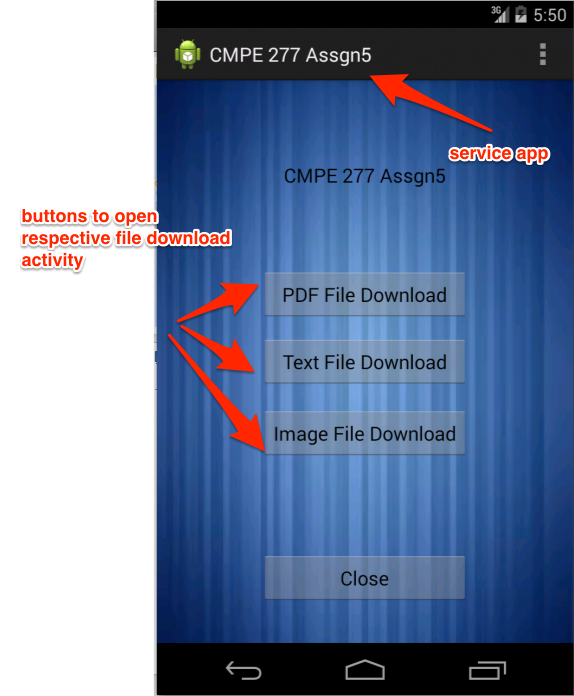
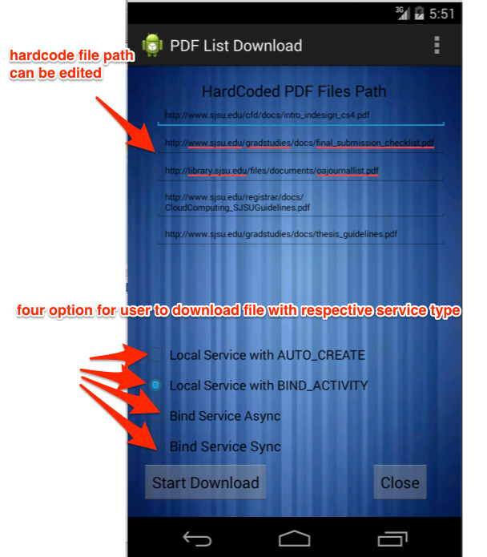
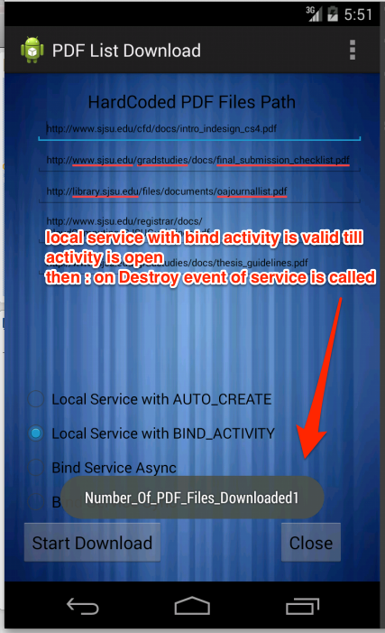
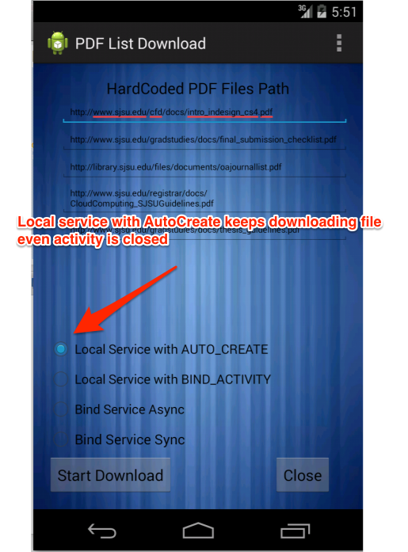
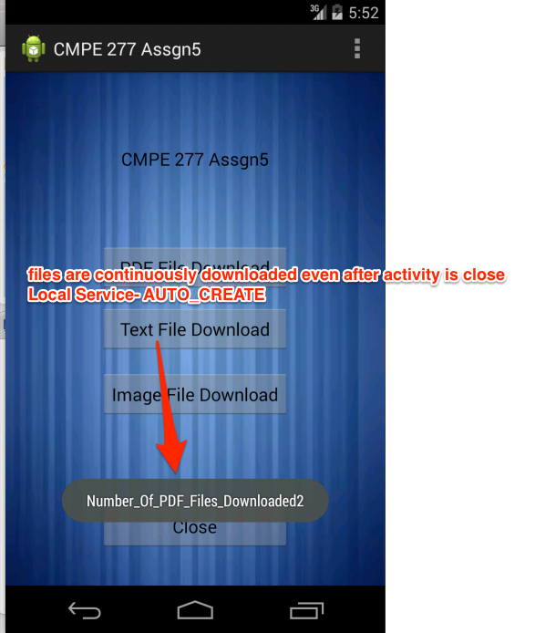
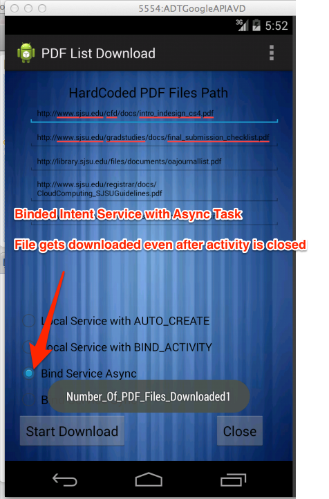
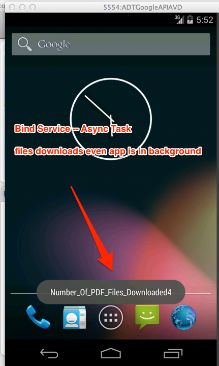
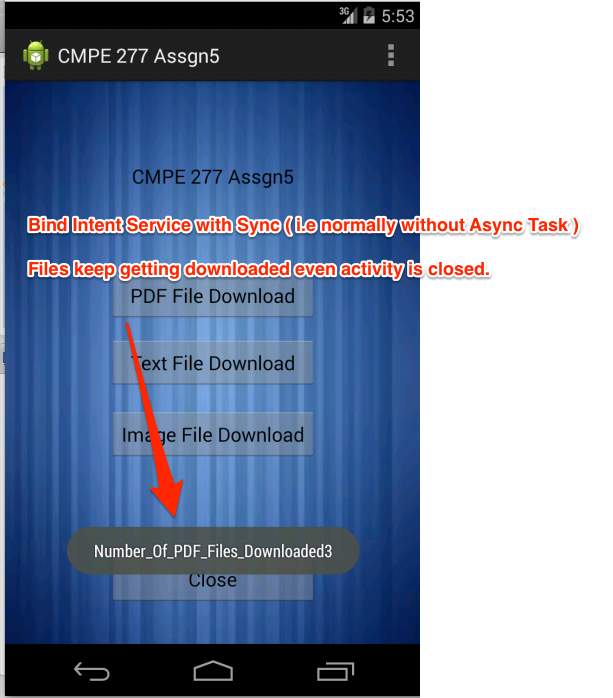
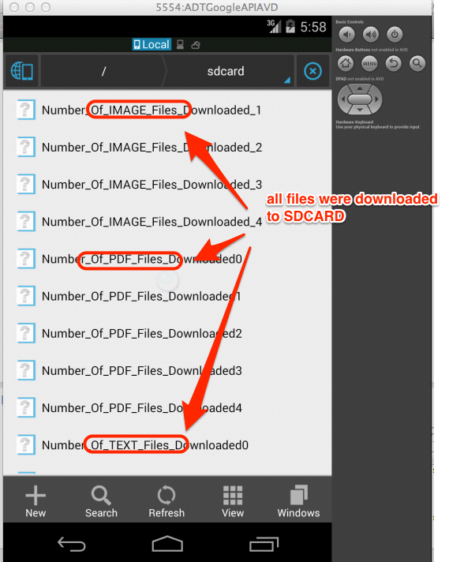

CMPE277Assgn5-AndroidApp-Services
=================================

This is CMPE 277 Assignment 4 to learn following things:  
1.Usage of Service in different ways like Bind Intent Service or Normal Local Service. 
2. To Understand Binding Service with different Parameters like BIND_WITH_ACTIVITY, BIND_AUTO_CREATE

ScreenShots
=============

